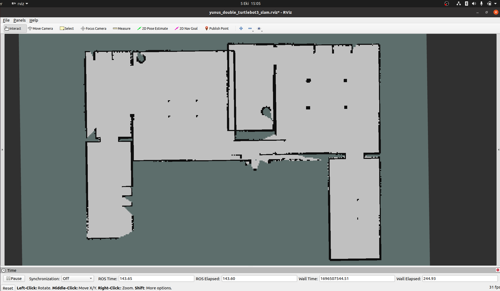
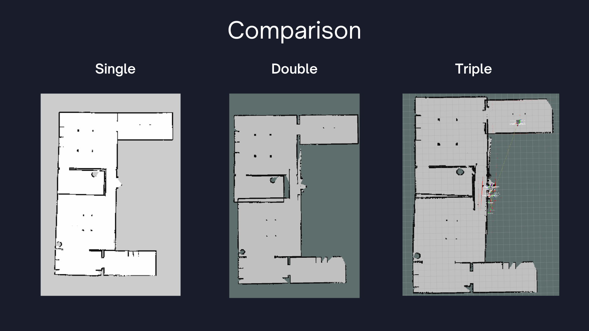
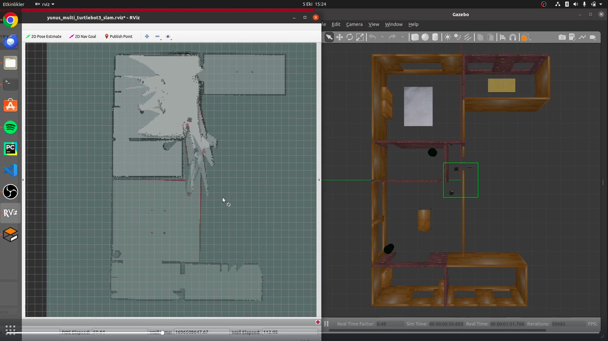

# Multiexplorer_YunusDanabas

This repository contains my first ROS project, developed after a 2-week ROS training and an additional 2 weeks of dedicated project work. The primary objective is to practice multi-robot frontier exploration in a simulated environment using TurtleBot3 robots, with a focus on autonomous exploration, SLAM, and map merging.
- **Autonomous Frontier Exploration** (`explore_lite`)
- **Simultaneous Localization and Mapping (SLAM)** (`gmapping`)
- **Multi-Robot Coordination** and **Map Merging** (`multirobot_map_merge`)

---

## Table of Contents

- [Overview](#overview)
- [Installation & Dependencies](#installation--dependencies)
- [Key Launch Files](#key-launch-files)
  - [1. Single Robot Exploration (`single_robot_exp.launch`)](#1-single-robot-exploration-singlerobot_explaunch)
  - [2. Double Robot Exploration (`double_robotexp.launch`)](#2-double-robot-exploration-doublerobotexplaunch)
  - [3. Triple Robot Exploration (`multi_robotexp.launch`)](#3-triple-robot-exploration-multi_robotexplaunch)
- [Other Launch Files (Helper / Experimental)](#other-launch-files-helper--experimental)
- [Presentation](#presentation)
- [Screenshots](#screenshots)
- [Author](#author)

---

## Overview

I developed this package to **compare single-, double-, and triple-robot exploration** performance in the TurtleBot3 `house.world`. Each robot runs its own **SLAM (Gmapping)** and **exploration node (explore_lite)**, and their maps are combined with **map_merge**.  
This project helped me understand **ROS launch files**, **multi-robot configurations**, and **SLAM** concepts in a practical way.

---

## Installation & Dependencies

1. **ROS Distro**: The code was tested on ROS Melodic/Noetic (adjust as needed).  
2. **TurtleBot3**: [TurtleBot3 packages](https://emanual.robotis.com/docs/en/platform/turtlebot3/quick-start/) must be installed.  
3. **Gazebo**: Comes with standard ROS installations.  
4. **Navigation Stack**: `move_base`, `dwa_local_planner`, etc.  
5. **explore_lite** and **multirobot_map_merge**:  
   ```bash
   sudo apt-get update
   sudo apt-get install ros-$ROS_DISTRO-explore-lite ros-$ROS_DISTRO-multirobot-map-merge
   ```
6. (Optional) **fiducial_slam** and **aruco_detect** if you want to explore marker-based localization (used in some helper launch files).

After installing the above, clone this repository into your catkin workspace, build, and source:

```bash
cd ~/catkin_ws/src
git clone <repo-url> multiexplorer_yunusdanabas
cd ~/catkin_ws
catkin_make
source devel/setup.bash
```

---

## Key Launch Files

Below are the three **main** launch files that demonstrate single-, double-, and triple-robot exploration with map merging.

### 1. Single Robot Exploration (`single_robot_exp.launch`)

- **Purpose**: Spawns **one** TurtleBot3 in Gazebo’s `turtlebot3_house.world`, launches Gmapping for SLAM, and starts an `explore_lite` node for autonomous exploration.
- **Key Components**:
  - **Gazebo Simulation**: Loads the empty world and inserts a single robot model.
  - **SLAM** (`turtlebot3_slam/gmapping`): Generates a 2D occupancy grid of the environment.
  - **`explore_lite`**: Performs frontier-based exploration to cover the environment automatically.
  - **Move Base**: The ROS navigation stack for path planning and obstacle avoidance.
- **How to Run**:
  ```bash
  roslaunch multiexplorer_yunusdanabas single_robot_exp.launch
  ```

### 2. Double Robot Exploration (`double_robotexp.launch`)

- **Purpose**: Spawns **two** TurtleBot3 robots in the same Gazebo world, each running its own SLAM (Gmapping) and exploration node.
- **Key Components**:
  - **Two Robots**: Namespaced as `tb3_0` and `tb3_1`.
  - **Separate Gmapping Instances**: Each robot has its own SLAM instance, publishing maps on `tb3_0/map` and `tb3_1/map`.
  - **`explore_lite`** for Each Robot: Each robot independently explores from its starting position.
  - **`multirobot_map_merge`**: Merges the two maps into one global topic (`/tb3/map`).
  - **Transform Publishers**: Static transforms to align each robot’s `map` frame to the global `map` frame.
- **How to Run**:
  ```bash
  roslaunch multiexplorer_yunusdanabas double_robotexp.launch
  ```

### 3. Triple Robot Exploration (`multi_robotexp.launch`)

- **Purpose**: Spawns **three** TurtleBot3 robots (`tb3_0`, `tb3_1`, and `tb3_2`), each with its own Gmapping SLAM and `explore_lite` node, merging all three maps together.
- **Key Components**:
  - **Three Robots**: Each has a unique namespace with separate transforms, costmaps, etc.
  - **SLAM**: Gmapping running for each robot.
  - **Exploration**: `explore_lite` on each robot for distributed frontier exploration.
  - **Map Merge**: Merges the maps into a single global map on `tb3/map`.
- **How to Run**:
  ```bash
  roslaunch multiexplorer_yunusdanabas multi_robotexp.launch
  ```

---

## Other Launch Files (Helper / Experimental)

The repository also contains various additional launch files that served as **helper code** or **experimental attempts** during my learning process:

- **`fiducial_slam_turtlebot3.launch`**: Demonstrates integrating Aruco markers with `fiducial_slam`.  
- **`multi_map_merge.launch`**: A dedicated file just for merging multiple robot maps.  
- **`multi_turtlebot3.launch`** and **`multi_turtlebot3_slam.launch`**: Additional tests for spawning multiple robots or running SLAM on a specific namespace.  

These launch files are optional or used for advanced experiments and are **not** the main focus of this project.

---

## Presentation

I have prepared a **Canva presentation** summarizing this project for end of my internship, which can be viewed here:

- [**Canva Presentation Link**](https://www.canva.com/design/DAGe6rFLM7U/w38mwYjYpvIZk73nA4x4lg/edit?utm_content=DAGe6rFLM7U&utm_campaign=designshare&utm_medium=link2&utm_source=sharebutton)  


---

## Screenshots

Here are some sample screenshots:

1. **Map**  
   

2. **Map Comparison**  
   

3. **From Simulation**  
   

---

## Author

**Yunus Emre Danabas**  
- *ROS Trainee & Developer*  
- Email: [yunusemredanabas@gmail.com](mailto:yunusemredanabas@gmail.com)

**Note**: This was my first ROS project, developed after a 2-week ROS training to practice multi-robot exploration, SLAM, and map merging concepts.
```
