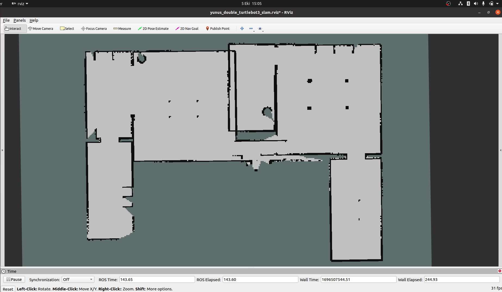
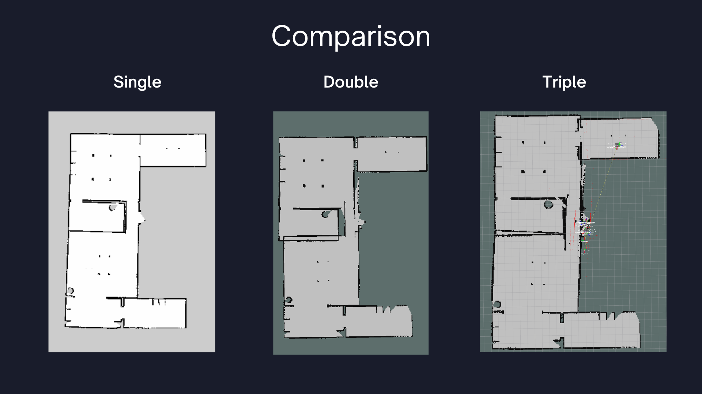
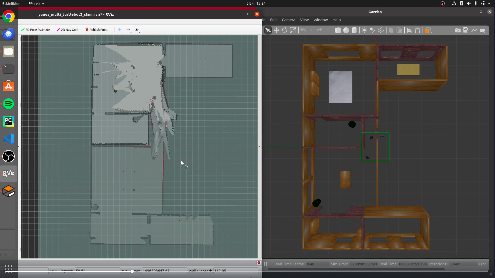

# multiexplorer_yunusdanabas

**ROS package for multi-robot frontier exploration with TurtleBot3**

This was my **first ROS project**, developed after a 2-week ROS boot camp and 2 additional weeks of focused project work. The implementation is intentionally basic, aimed at building a strong foundation in SLAM, navigation, and multi-robot coordination. It demonstrates and benchmarks **single-, double-, and triple-robot** autonomous exploration, SLAM, and map merging in a Gazebo house environment.

---


## 🚀 Overview

- **Frontier-based exploration** with `explore_lite`
- **SLAM** using `gmapping` (per robot)
- **Multi-robot map merging** via `multirobot_map_merge`
- **Simulation-only**: no physical hardware required—perfect for ROS beginners wanting to test coordination algorithms

---

## 🛠️  Features

| Capability | Implementation |
|-----------|----------------|
| Autonomous exploration | `explore_lite` searches frontiers, plans paths with the navigation stack |
| Per-robot SLAM | Independent `gmapping` node per TurtleBot3 namespace |
| Global mapping | `multirobot_map_merge` aligns and fuses local maps (`/tb3/map`) |
| Gazebo worlds | Default: `turtlebot3_house.world` |
| Extensible | Extra launch files for ArUco-based `fiducial_slam`, map-merge only tests, etc. |

---

## 🖥️  Demo Video & Slides

- **Canva presentation** → <https://www.canva.com/design/DAGe6rFLM7U/w38mwYjYpvIZk73nA4x4lg/edit>

---

## 🛠️  Prerequisites

| Software | Tested Versions |
|----------|----------------|
| Ubuntu | 20.04 / 22.04 |
| ROS | Melodic / Noetic |
| TurtleBot3 packages | `turtlebot3_description`, `turtlebot3_gazebo`, `turtlebot3_slam` |
| Navigation stack | `move_base`, `dwa_local_planner` |
| Extra | `explore_lite`, `multirobot_map_merge` (`apt-get install ros-$ROS_DISTRO-<pkg>`) |

---

## 📦 Installation

```bash
# clone into an existing catkin workspace
cd ~/catkin_ws/src
git clone https://github.com/yunusdanabas/multiexplorer_yunusdanabas.git
cd ~/catkin_ws

# install OS/ROS deps
rosdep install --from-paths src --ignore-src -r -y

# build & source
catkin_make           # or colcon build
source devel/setup.bash
````

---

## 🎮 Quick Start

Launch one of the pre-made scenarios:

```bash
# Single robot
roslaunch multiexplorer_yunusdanabas single_robot_exp.launch

# Two robots
roslaunch multiexplorer_yunusdanabas double_robotexp.launch

# Three robots
roslaunch multiexplorer_yunusdanabas multi_robotexp.launch
```

> **Tip :** pass `gui:=false` to any launch file for headless runs.

---

## 🔧 Launch Files & Usage

| File                              | Robots | Purpose                                 |
| --------------------------------- | ------ | --------------------------------------- |
| `single_robot_exp.launch`         | 1      | SLAM + `explore_lite` + navigation      |
| `double_robotexp.launch`          | 2      | Namespaces `tb3_0`/`tb3_1`, merges maps |
| `multi_robotexp.launch`           | 3      | Scales to 3 robots (`tb3_0…2`)          |
| `fiducial_slam_turtlebot3.launch` | 1      | Experimental ArUco-marker SLAM          |
| `multi_map_merge.launch`          | –      | Merge any set of `/map` topics only     |

Each launch file spawns Gazebo, RViz (optional), navigation stack, SLAM, and exploration nodes with correct TF prefixes.

---

## 📂 Package Structure

```
multiexplorer_yunusdanabas/
├── launch/               # one-click experiments
│   ├── single_robot_exp.launch
│   ├── double_robotexp.launch
│   ├── multi_robotexp.launch
│   └── ...
├── worlds/               # Gazebo worlds (house, empty, custom)
├── rviz/                 # RViz configs
├── models/               # extra models, markers
├── maps/                 # saved occupancy grids
├── README.md
├── CMakeLists.txt
└── package.xml
```

---

## 📸 Gallery

### 🧭 Single-Robot Map


### 🗺️ Multi-Robot Merged Map


### 🏠 Gazebo Simulation Snapshot


---


## 🤝 Acknowledgements

Developed during my internship at **TÜBİTAK BİLGEM** (Robotics), supervised by the ROS training team.

---

## 📄 License

Released under the **MIT License**

---

## ✍Author

**Yunus Emre Danabaş**

```

Feel free to tweak section titles, add more screenshots, or include benchmark plots as the project evolves.
```
